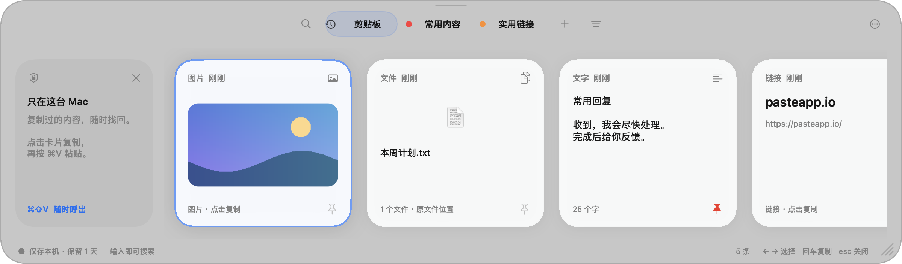
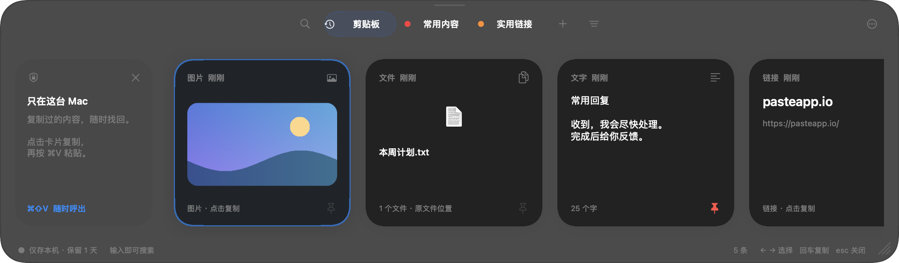
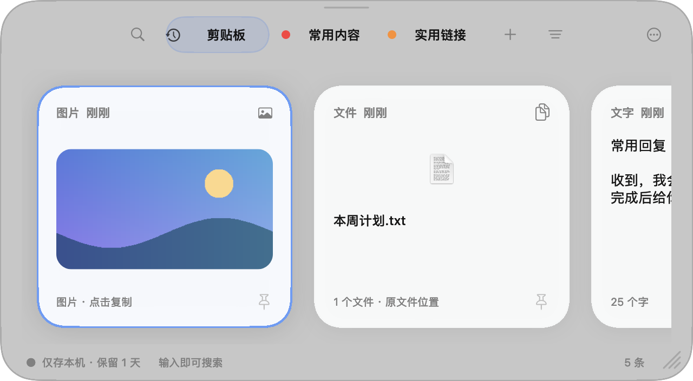

# 本地剪贴板

一个参考 Paste 使用方式制作的原生 macOS 工具。按 `⌘⇧V` 呼出屏幕底部的半透明横向面板，搜索或固定常用内容；点击卡片会把内容放回系统剪贴板并返回刚才的应用，然后按 `⌘V` 粘贴。

## 界面预览

以下界面使用示例内容，不包含真实剪贴板记录。





调整为较窄的面板后，工具栏和内容区域会自动适应：



## 功能

- 自动保存最近复制的文字、链接、图片和文件
- 底部横向大卡片、图片缩略图、明暗主题；触控板或鼠标滚轮浏览历史
- 连续圆角、轻柔阴影和悬停过渡；面板滑入淡出，键盘切换与鼠标滚轮平滑滚动
- 拖动面板边缘或右下角调整宽度与高度；自动记住尺寸，较窄时简化工具栏，较高时显示更大的卡片
- 顶部搜索和分组标签，右侧筛选按钮支持文字 / 链接 / 图片 / 文件类型筛选
- 点击“＋”新建固定分组，右键点击卡片可将其加入分组或删除
- 搜索内容、文件名和来源应用；固定、删除单条记录，或清空全部历史
- 左右方向键选择卡片，回车复制，Esc 关闭；直接输入即可搜索，也可以点击菜单栏图标打开
- 可随时暂停和恢复记录；最多保留 200 条，优先移除未固定的旧记录
- 历史保留时间可设为 1 天、3 天、5 天或一周，默认 1 天；到期自动清理，固定内容继续保留
- 单条文字最多 1 MB、单张图片最多 10 MB；图片历史总量控制在约 200 MB
- 仅保存在 `~/Library/Application Support/LocalPaste/`，无需账号，不联网、不做云同步
- 忽略剪贴板标记为密码或临时内容的项目（若来源应用提供此标记）

密码管理器通常会标记敏感复制内容，但并非所有应用都会这样做。剪贴板内容仍可能包含敏感信息，请在面板中暂停记录或清空历史。

文件记录保存的是原文件位置；原文件被移动或删除后不能再从该记录复制。图片会保存本地副本。固定内容不受普通新记录的挤出影响；全部 200 条都被固定时，需要先取消固定或删除部分内容，才有空间记录新项目。

## 构建和运行

需要 macOS 13 或更高版本及 Apple Command Line Tools：

```sh
./build.sh
open "build/本地剪贴板.app"
```

运行本地自检（使用临时目录和独立测试剪贴板，不读取或修改当前剪贴板）：

```sh
make check
```

构建完成后，也可以从 Finder 打开 `build/本地剪贴板.app`。应用会显示在菜单栏，不会出现在 Dock。

应用运行时自动记录新复制内容。退出或重启后，重新打开应用即可继续记录，之前保存的历史会保留。应用尚未设置开机自动启动。

右上角“…”菜单可以暂停记录、新建分组、清空历史或退出应用。首次显示的使用提示卡片可点击“×”关闭，之后不会重复显示。分组同样只保存在本机的 `boards.json` 文件中。

拖动右下角的斜线或面板边缘即可调整大小，最小尺寸为 640 × 352。重新打开或重启应用后会保留你设置的尺寸；切换到较小的屏幕时会自动适应可用空间。“…”菜单中的“恢复默认大小”会恢复屏幕底部的宽面板。

在“…” → “历史保留时间”中选择 1 天、3 天、5 天或一周，默认为 1 天（24 小时）。时间从最近一次复制该内容开始计算。普通历史到期后会自动删除，图片的本地历史副本一并清理，文件记录中的原始文件不受影响。应用运行时每分钟检查一次，暂停记录时也会检查；启动和呼出面板时会立即清理到期内容。

固定内容不随时间自动删除；取消固定时，已经超出保留时间的记录会立即清理。缩短保留时间会立即清理超出新期限的普通历史，延长时间只影响尚未删除的内容。设置保存在本机的 `settings.json` 中，重启后仍然生效。

如果系统开启“减少动态效果”，界面会自动关闭过渡动画。图片缩略图在内存中缓存，提示文字变化时也会复用现有卡片，避免反复绘制。

生成使用示例数据的明暗界面预览：

```sh
"build/本地剪贴板.app/Contents/MacOS/LocalPaste" --render-preview build/preview-light.png
"build/本地剪贴板.app/Contents/MacOS/LocalPaste" --render-preview build/preview-dark.png --dark
"build/本地剪贴板.app/Contents/MacOS/LocalPaste" --render-preview build/preview-compact.png --size 640 352
```
